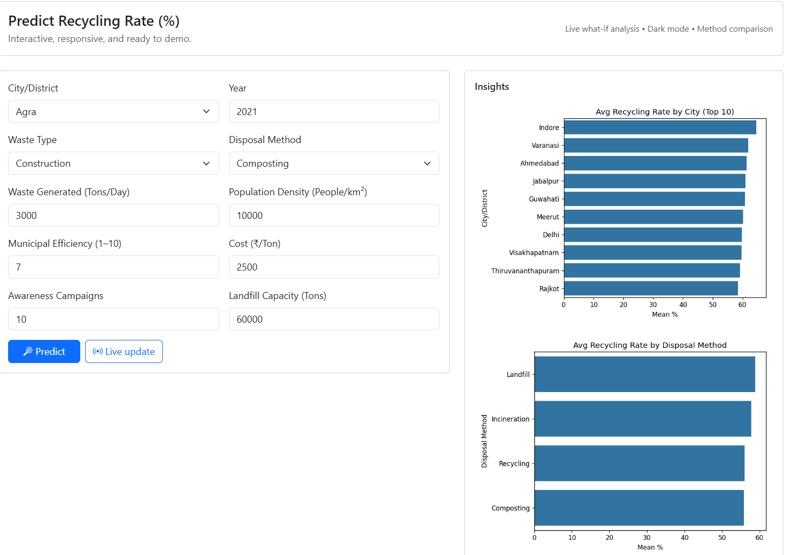
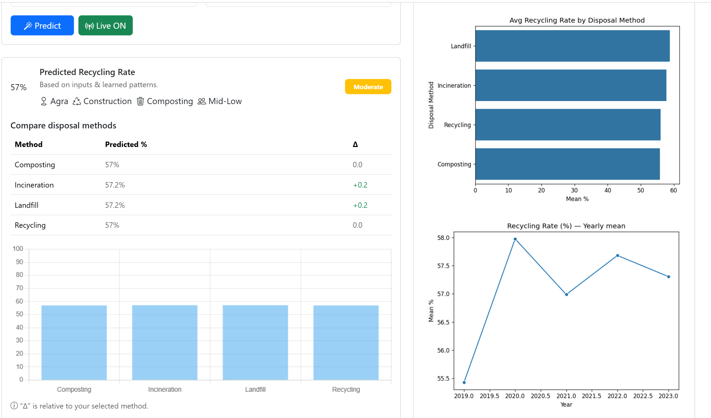
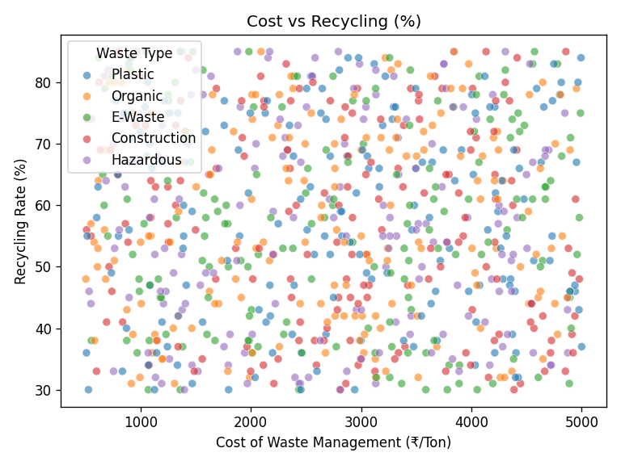
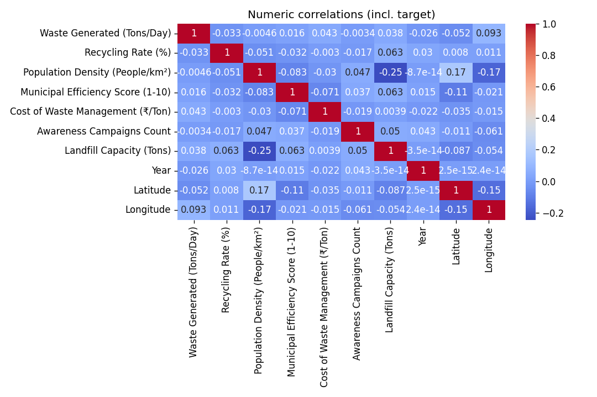

# ♻️ Waste-Intel — AI-Powered Waste Management Insights

🚀 **Waste-Intel** is a machine learning powered web application built with **Flask + CatBoost + Pandas**, designed to predict recycling rates, compare disposal methods, and provide city-level insights for waste management.  

It is now deployed live on **AWS Elastic Beanstalk (no Docker)** for public access.  

[🔴 Live Demo](http://waste-intel-env.eba-8yjfan8t.ap-south-1.elasticbeanstalk.com) ·
---

## ✨ Features
- 📊 **AI Prediction**: Forecasts recycling rate (%) using CatBoost ML model.  
- 🏙️ **City Insights**: Select any city/district to see average recycling performance.  
- 🔄 **Method Comparison**: Quickly compare recycling, composting, incineration, and landfill efficiency.  
- 📈 **Charts & Analytics**: EDA visualizations for top cities, disposal methods, and yearly trends.  
- ⚡ **Fast Deployment**: Hosted on AWS Elastic Beanstalk for global availability.  
- 🔐 **Environment Configurable**: Contact links (GitHub, LinkedIn, Email) driven via ENV variables.  

---

## 🖼️ Screenshots

| Home Page | Prediction Result |
|-----------|------------------|
|  |  |
|  |  |

---

## ⚙️ Tech Stack
- **Frontend**: HTML, CSS (Bootstrap), Jinja2 templates  
- **Backend**: Python (Flask)  
- **ML Model**: CatBoost Regressor  
- **Data Handling**: Pandas, CSV-based processed dataset  
- **Deployment**: AWS Elastic Beanstalk (Python 3.11 platform)  

---

## 🚀 Local Setup

### 1. Clone this repository:
```bash
git clone https://github.com/codebreaker-pk/waste-intel.git
cd waste-intel
```

### 2. Create and activate a virtual environment
```bash
python -m venv .venv
# (Linux/Mac)
source .venv/bin/activate
# (Windows)
.venv\Scripts\activate
```

### 3. Install dependencies
```bash
pip install -r requirements.txt
```

### 4. Run the app
```bash
python app.py
```

### 5. Open in browser
```
http://127.0.0.1:5000/
```

---

## ☁️ AWS Deployment (No Docker)

Steps followed for deployment on **AWS Elastic Beanstalk**:

1. Installed **AWS CLI + EB CLI**, configured IAM credentials.  
2. Created an application + environment in Elastic Beanstalk (`python-3.11`).  
3. Prepared deployment bundle with:
   - `app.py` (Flask app)  
   - `wsgi.py` (entrypoint)  
   - `Procfile` (Gunicorn command)  
   - `requirements.txt`  
   - `templates/`, `static/`, `models/`, `data/` folders  
4. Deployed using:
   ```bash
   eb init -p python-3.11 waste-intel --region ap-south-1
   eb create waste-intel-env
   eb deploy
   ```
5. Configured:
   - Environment variables (contacts, Flask env)  
   - Health check at `/healthz`  

---

## 📂 Project Structure
```
waste-intel/
│── app.py              # Main Flask app
│── wsgi.py             # Entry point for Gunicorn
│── Procfile            # Deployment instructions
│── requirements.txt    # Dependencies
│── models/             # Pre-trained CatBoost models
│── data/               # Processed CSV dataset
│── templates/          # Jinja2 HTML templates
│── static/             # CSS, JS, Images, Charts
│── .ebextensions/      # Elastic Beanstalk configs
│── .elasticbeanstalk/  # EB CLI config (local)
```

---

## 👨‍💻 Author

**Prashant Kumar**

🔗 [GitHub](https://github.com/codebreaker-pk)  
🔗 [LinkedIn](https://www.linkedin.com/in/prash)

---

## 🌟 Acknowledgements
- [CatBoost](https://catboost.ai/) for robust gradient boosting ML.  
- [AWS Elastic Beanstalk](https://aws.amazon.com/elasticbeanstalk/) for hassle-free deployment.  
- [OpenAI ChatGPT](https://openai.com/) for debugging & deployment assistance.  

---

## ⭐ Show Your Support
If you like this project, give it a **star ⭐ on GitHub** — it helps a lot!
